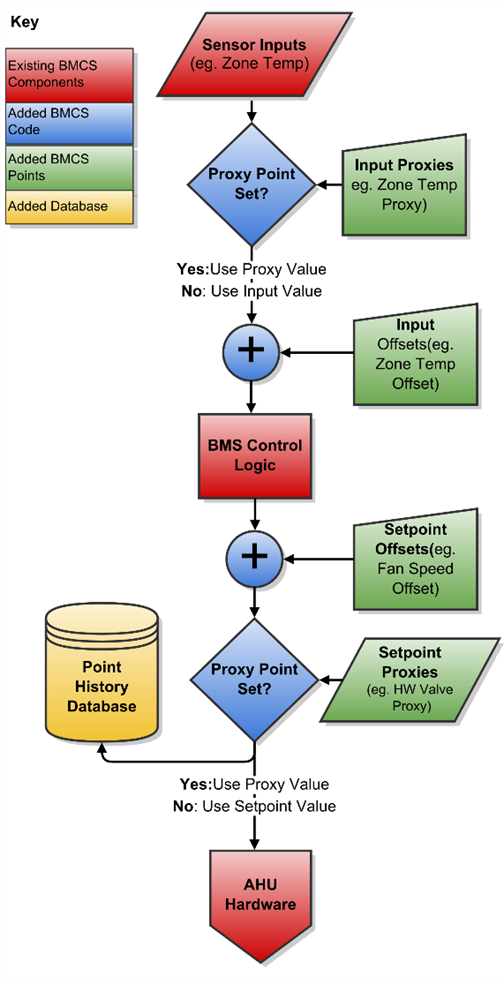
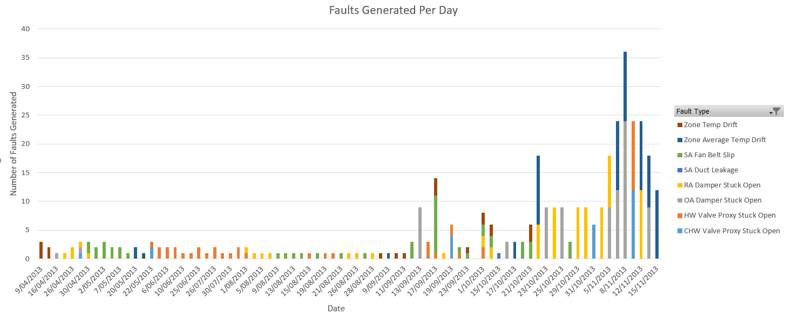
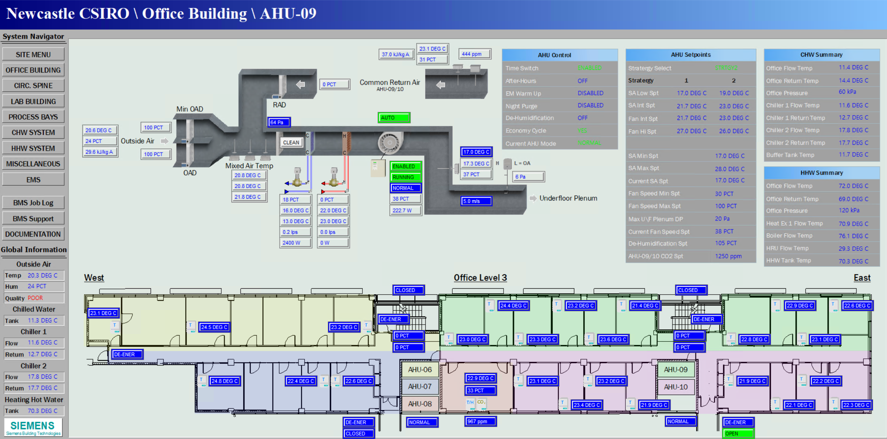

# ahu-fault-detection-dataset

Dataset containing fault-generation experiments on two of CSIRO Energy's Newcastle Office building Air Handling Units (AHU) system.
This is intended to provide a reference dataset for the development and comparison of new fault detection and diagnosis (FDD) algorithms for Heating Ventilation and Air Conditioning (HVAC) systems.

This dataset was generated by inserting faults into the Building Management System (BMS) of an operational 4-storey office building in Newcastle, Australia in April-November 2013. 
This data is made available as-is for use by other researchers, and minimal support or maintenance will be provided, and only at the authors' discretion.

Fault types generated include:

* Leaking supply-air duct
* Slipping supply-air fan belt
* Stuck/leaking hot water valve
* Stuck/leaking chilled water valve
* Stuck/leaking outside air damper
* Stuck/leaking return air damper
* Average zone air temperature sensor offset
* Single zone air temperature sensor failure

Faults were designed for comparing standardised rule-based Fault Detection and Diagnosis (FDD) rules to more advanced techniques.

These faults were generated by adding 'proxy' points into the BMS code which can override the control signals sent to actuators or received from sensors, while masking the real values from the BMS's
control logic. This diagram sums up the changes made to the BMS to simulate these faults:



The actual fault type and magnitude was randomised by custom fault generation software. A summary of the faults generated is below.


AHU 9 & 10 Schematic


## Referencing

If you use this dataset in your research or publications, please cite the following paper:

`Guo, Ying; Wall, Josh; Li, Jiaming; West, Sam. Intelligent Model Based Fault Detection and Diagnosis for HVAC System Using Statistical Machine Learning Methods. In: ASHRAE 2013 Winter Conference; January 26 - 30, 2013; Dallas, USA. ASHRAE; 2013. 119-124. http://hdl.handle.net/102.100.100/98252?index=1`

See [here](http://hdl.handle.net/102.100.100/98252)
or [here](https://www.researchgate.net/publication/262640090_Intelligent_Model_Based_Fault_Detection_and_Diagnosis_for_HVAC_System_Using_Statistical_Machine_Learning_Methods) for the paper.

## License

See [LICENSE](LICENSE) for code license.

Data is licensed under the [Creative Commons Attribution-ShareAlike 4.0 International Public License](http://creativecommons.org/licenses/by-sa/4.0/).

## Quick start:

If you just want to access the data, do this:

```shell
git clone <this-repo-url>
git lfs install
git lfs pull
```
After that, you should have the data in the `data/` directory.

For an example of how to join the time-series data to the ground truth table, see `join_ground_truth()` in [data_wrangling.py](src/hvac_fdd_dataset/data_wrangling.py)


## Development
If cloning this to set up the environment for development, run these commands:

```shell
git clone <this-repo.git>
cd  <this-repo-url>

# We recommend using `pyenv` to manage multiple python versions. If pyenv is installed, just run:
pyenv install 3.9.13 # or whatever >=3.9 version you'd prefer
pyenv local 3.9.13 

# ...OR if you don't use pyenv, run:
poetry env use c:\path\to\python3.9\python.exe # Windows  
poetry env use /path/to/python39 # Linux/Mac

# install libraries
poetry install

# install pre-commit hooks for code quality etc
pre-commit install

# run tests locally
pytest

```


